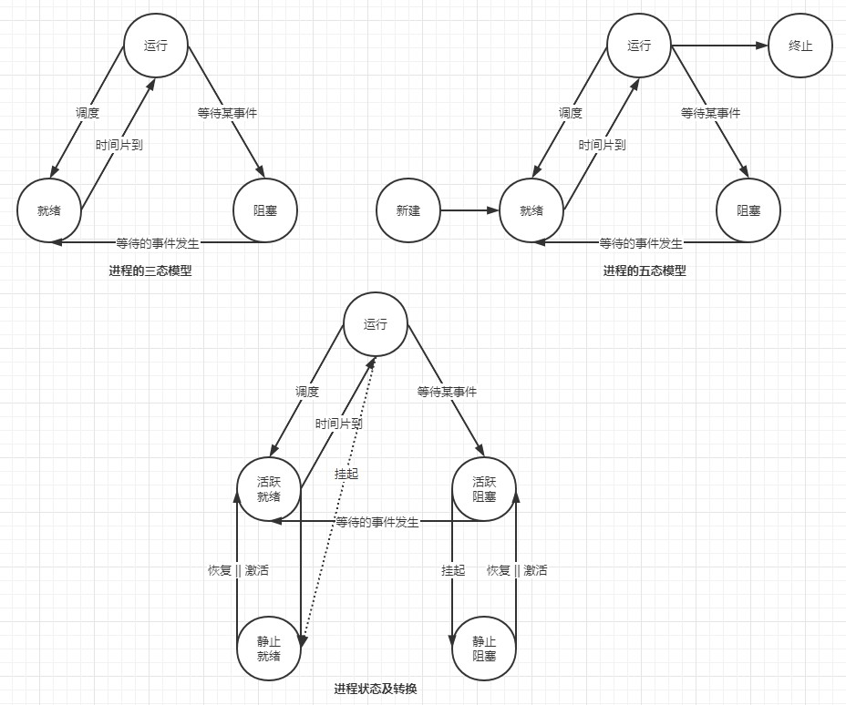

# 系统架构设计师

## 一、绪论

### 1.软件系统架构

#### 1.1.概念

- 软件系统架构是关于软件系统的结构、行为、和属性的**高级抽象**。
  - 在描述阶段: 其对象是直接构成系统的抽象组件以及各个组件之间的连接规则，特别是相对细致的描述组件之间的**通信**。
  - 在实现阶段: 这些抽象组件被细化为实际组件，比如具体的类或者对象。
- 软件系统架构不仅指定了软件系统的**组织结构**和**拓扑结构**，而且显示了系统需求和构成组件之间的对应关系，包括**设计决策**的**基本方法**和**基本理论**

#### 1.2.企业软件架构

- 企业**需求**是软件架构发展的**引擎**

### 2.系统架构师知识结构

- 战略规划能力
- 业务流程建模能力
- 信息数据架构能力
- 技术架构选择和实现能力
- 应用系统架构的解决和实现能力
- 基础IT知识和基础设施、资源调配的能力
-  信息安全技术支持和管理保障能力
- IT审计、治理和基础需求分析、获取能力
- 面向软件系统可靠性与系统生命周期的质量保障服务能力

## 二、计算机与网络基础知识

> **概念**

- 计算机系统由硬件和软件两部分组成。
- 软件分类
  - 系统软件
    - 系统软件支持应用软件的运行，为用户开发应用软件提供平台他，用户可以使用它，但不能随机膝盖它。（操作系统、语言处理程序、连接程序、诊断程序、数据库管理系统等）
  - 应用软件
    - 指计算机用户利用计算机的软、引荐资源为莫i一专门的应用目的而开发的软件。

### 2.1.操作系统知识

#### 2.1.1.操作系统

> 操作系统(Operating System, OS)
>
> > 是计算机系统的核心系统软件，其他软件是建立在操作系统基础上的，并在操作系统的统一管理和支持下运行。

- 操作系统的作用
  - 通过资源管理，提高计算机系统的效率
  - 改善人机界面，向用户提供友好的工作环境
- 操作系统的分类
  - 单用户操作系统 && 批处理操作系统
  - 分时操作系统 && 实时操作系统
  - 网络操作系统 && 分布式操纵系统
  - 嵌入式操作系统
- 操作系统的特征
  - 并发性(concurrency)
  - 共享性(sharing)
  - 虚拟性(virtual)
  - 不确定性(non-determinacy)
- 操作系统的功能
  - 进程管理
  - 文件管理
  - 存储管理
  - 设备管理
  - 作业管理

#### 2.1.2.进程

**定义**:

> 进程(process) 是资源分配和独立运行的**基本单位**。
>
> 进程是程序的一次执行，该程序可以和其他程序并发执行。
>
> > 进程 ~= 程序 + 数据 + 进程控制块(Process Control Block, PCB) 
> >
> > PCB: 描述了进程的基本情况，是进程存在的唯一标识。
> >
> > 程序: 静态的**指令序列**。
> >
> > 进程: 为执行该程序的线程而保留的**资源集**。

**分类**:

- 系统进程 && 用户进程

- 父进程 && 子进程

进程状态模型:

**进程控制**: 对系统中所有进程从创建到消亡的全过程实施有效的控制。

> 进程控制是通过进程**控制原语**来实现的，进程控制原语主要有：
>
> - 创建原语
> - 撤销原语
> - 挂起原语
> - 激活原语
> - 阻塞原语
> - 唤醒原语

**临界区**:

> 互斥临界区管理原则:
>
> > 有空则进、无空则等、有限等待、让权等待

### 测试密钥登录

